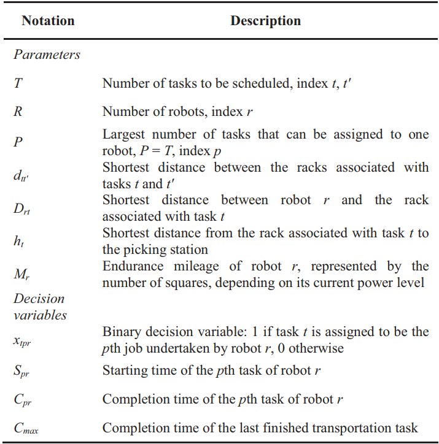
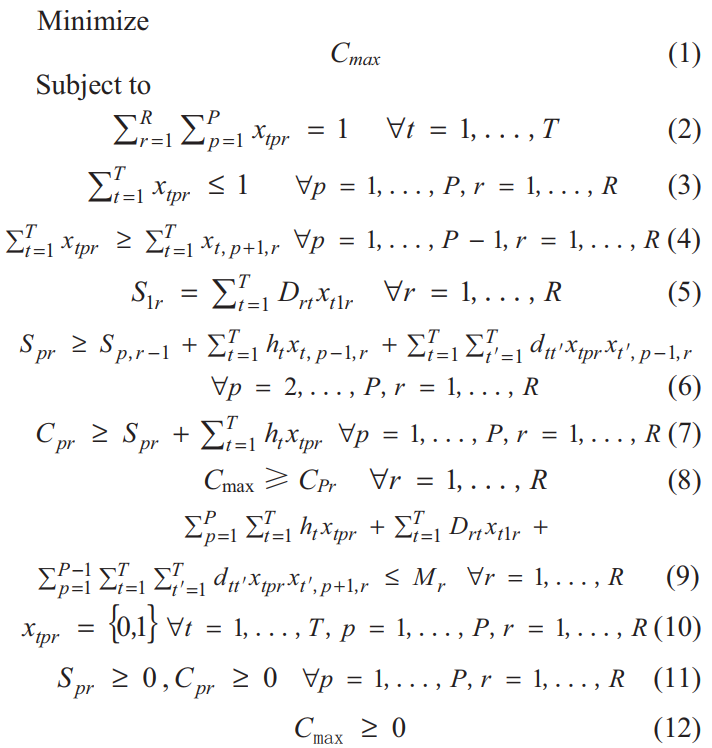
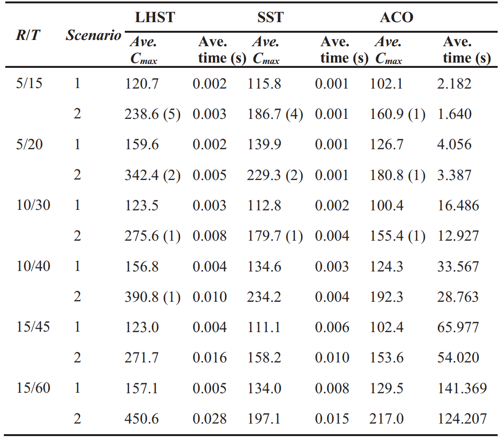

An example of using **Ant Colony Algorithm** for **task scheduling problem in Mobile Robot Fulfillment Systems**.

------

A mixed integer programming model is presented to describe the problem  as follows:

This paper explicitly studies a multi-robot scheduling problem with the objective of makespan minimization in a
MRFS environment for the first time. Two **heuristic rules (LHST, SST)** and an **ACO algorithm** are developed to solve the problem.   

The results show that in most cases all the three proposed heuristics can result in feasible solutions within acceptable time durations, and ACO can generally produce the best schedules.  

------

More details can be found in the paper "**A Task Scheduling Problem in Mobile Robot Fulfillment Systems**". Download the paper at the following website: https://ieeexplore.ieee.org/document/9177514.